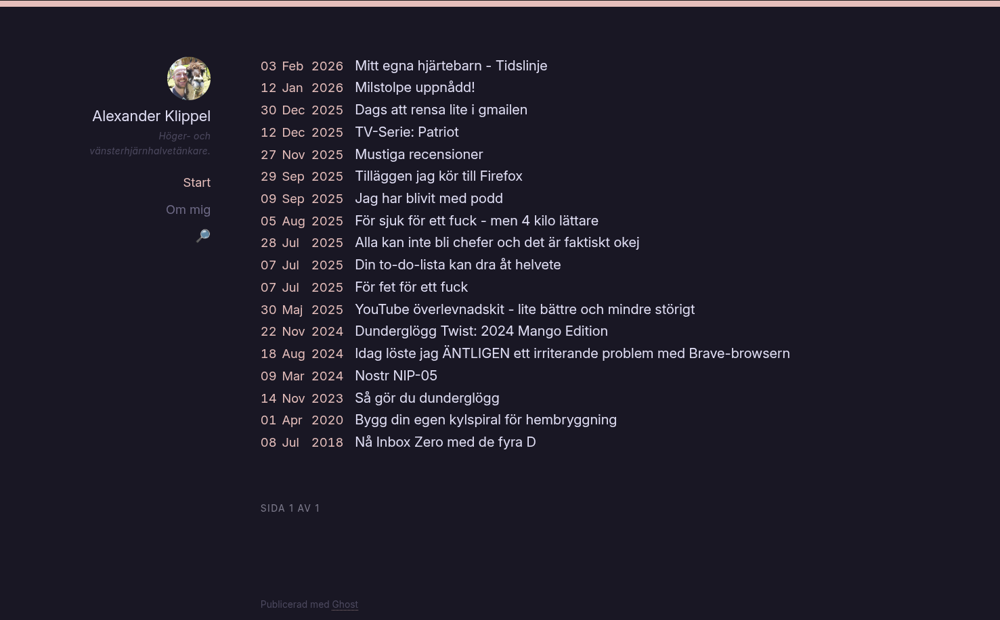

# Marginal

A retro-minimalist Ghost theme with IndieWeb microformats, dark mode, and zero JavaScript.



## Features

- **IndieWeb-ready** — Full microformat2 markup (`h-feed`, `h-entry`, `h-card`) for compatibility with IndieWeb readers and services
- **Zero runtime JavaScript** — CSS-only responsive layout with a checkbox-hack mobile menu
- **Dark mode** — Automatic light/dark switching via `prefers-color-scheme`
- **8 color palettes** — Default, Catppuccin Mocha, Dracula, Nord, Gruvbox, Tokyo Night, Rose Pine, and Everforest — selectable from Ghost Admin
- **8 font choices** — Inter, Source Sans 3, DM Sans, Space Grotesk, Libre Baskerville, JetBrains Mono, IBM Plex Mono, and Courier Prime
- **Adjustable density** — Compact, normal, and spacious spacing options
- **Layout alignment** — Left, off-center, or centered content positioning
- **Ghost Members** — Built-in signup, signin, and account pages

## Layout

Two-column CSS Grid with navigation on the left and content on the right. Collapses to a single column on small screens. No frameworks, no dependencies at runtime.

## Templates

| File | Purpose |
|------|---------|
| `default.hbs` | Master layout (header, nav, main, footer) |
| `index.hbs` | Home page with date-indexed post list |
| `post.hbs` | Single post with feature image, reading time, author byline, comments |
| `page.hbs` | Static pages |
| `tag.hbs` | Tag archive |
| `author.hbs` | Author archive with profile card |
| `error.hbs` | Standalone error page |

## Development

Requires [Ghost](https://ghost.org/) >= 5.0.0 and [Node.js](https://nodejs.org/).

Symlink the theme into your local Ghost install:

```bash
ln -s /path/to/marginal /path/to/ghost/content/themes/marginal
```

Install dependencies and start developing:

```bash
npm install
npm run dev
```

Changes to `.hbs`, CSS, and JS files reload automatically in the browser.

### Other commands

```bash
npm run build   # Production build (CSS/JS to assets/built/)
npm run test    # Build + validate with gscan
npm run zip     # Build + create distributable zip
```

## Deployment

A GitHub Actions workflow is included at `.github/workflows/deploy-theme.yml`. It deploys automatically on push to `main`. Add these repository secrets:

- `GHOST_ADMIN_API_URL`
- `GHOST_ADMIN_API_KEY`

## CSS Architecture

All styles are compiled from `assets/css/index.css` via Rollup + PostCSS:

```
assets/css/
  index.css            Main entry (imports everything below)
  vars.css             Custom properties, color palettes, dark mode
  components/          Reset, forms, buttons
  ghost/               Header, content, footer, members, pagination, etc.
```

Color palettes use OKLCh values with hex fallbacks. Font stacks and spacing are controlled through CSS custom properties toggled by Ghost Admin settings.

## License

Copyright (c) 2013-2026 Ghost Foundation. Released under the [MIT License](LICENSE).
